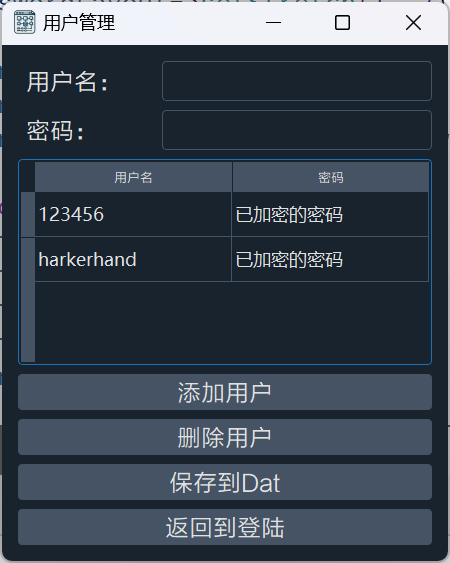
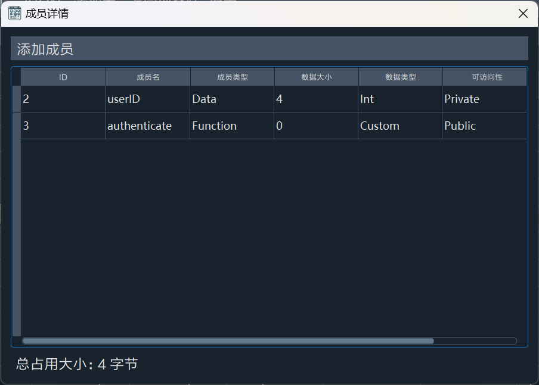
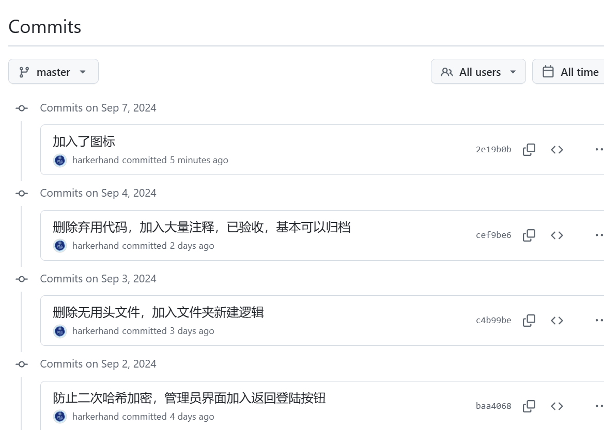

# 24暑期学校课设报告

## 一 、题目

*（把题目复制一遍。如果是自拟的题目，把题目具体内容写在这里）*

**题目4：面向对象程序项目管理系统**

> [要求]该系统需创建和管理如下信息：1、类信息：编号、类名、基类名、功能、创建日期、作者、类成员数据集；2、类成员信息：成员编号、成员名称、成员类型（数据或函数）、内存字节数（数据成员）、数据类型、可访问性（公有、私有、保护）等。

> 系统功能要求如下：
>
> - 创建和管理类信息的对象；
>
> - 创建和管理类成员信息的对象；
> - 增加和删除类；
> - 针对特定类增加或删除类成员信息；
> - 基本查询功能；
> - 数据文件读写：文件中包含所有类信息、每个类的类成员信息等数据；
> - 基本信息显示：1）所有类的信息显示；2）特定类的类成员信息；
> - 可选功能提升：显示类对象的占用内存信息等。

## 二 、设计思路

*（这里分几部分：1、C++部分，包括几个类，各个类的功能，以及类的相互关系；2、Qt部分，用了什么框架，设计了几个ui，每个ui控件的功能，以及他们的相互关系；3、程序所完成的功能）*

### 1. C++ 部分

#### 1.1 类及功能

- `ClassInfo`

  功能：用于表示一个类的信息，包括类的基本属性（如ID、名称、基类名、功能、创建日期、作者）和类的成员（数据成员或函数成员）。

  主要方法：

  ```cpp
  addMember(); removeMember(); // 添加和删除类成员
  calculateMemorySize(); // 计算类的总内存占用。
  saveToStream(); loadFromStream(); // 序列化与反序列化。
  ```

- `ClassMember`

  功能：表示一个类的成员，包括成员的ID、名称、类型（数据成员或函数成员）、内存大小、数据类型和访问权限。

  主要方法：

  ```cpp
  saveToStream(); loadFromStream(); // 序列化与反序列化。
  ```

- `Enums`

  功能： 定义了程序中用到的各种枚举类型，如成员类型（`MemberType`）、访问权限（`Accessibility`）、数据类型（`DataType`）、用户类型（`UserType`）。提供了将枚举转换为字符串的方法。

- `ClassModel`、`MemberModel`、`UserModel`

  功能： 用于在表格视图中显示对象的模型类，继承自`QAbstractTableModel`。

  主要方法：

  ```cpp
  data(); // 返回表格单元格的数据显示。
  headerData(); // 返回表格列头的数据。
  ```

- `Utils`

  功能: 包含一些辅助函数，如获取数据类型的大小、密码哈希处理、账户的保存和验证等。

  主要方法：

  ```cpp
  getDataTypeSize(); // 返回数据类型的大小。
  hashPassword(); // 对密码进行哈希处理。
  saveAdminAccount(); saveUserAccount(); // 保存管理员和用户账户信息。
  verifyAccount(); // 验证账户信息。
  ```

- 其他ui类

  - `CreateClassDialog` 创建类（可复用为修改类）
  - `CreateMemberDialog` 创建成员（可复用为修改成员）
  - `LoginWindow` 登录窗口
  - `MainWindow` 主窗口
  - `MemberDetailsDialog` 单个成员详情
  - `MembersDetailDialog` 所有成员详情
  - `SearchDialog` 搜索对话框
  - `SimpleTextDialog` 简易文字对话框
  - `UserManagementWindow` 用户管理窗口

#### 1.2 类的相互关系

- `ClassInfo` 包含多个 `ClassMember` 对象，通过 `_members` 列表进行管理。

- `ClassModel` 和 `MemberModel` 用于在视图中显示 `ClassInfo` 和 `ClassMember` 对象的信息，分别作为表格视图的模型。`UserModel` 用于显示用户信息，与用户管理窗口 `UserManagementWindow` 进行交互。
- `Utils` 提供辅助函数，被其他类和模块调用以实现功能，如账户验证、密码处理等。

### 2. Qt部分

#### 2.1使用的框架

- **Qt Widgets**
  - **功能:** 提供传统的桌面应用程序界面组件，如窗口、按钮、文本框、对话框等。
  - **示例: ** `QWidget`, `QPushButton`, `QLineEdit`, `QTableView`

- **Qt Core**
  - **功能:** 提供底层功能，包括事件处理、文件和数据流处理、时间管理、数据管理等。
  - **示例: ** `QIODevice`, `QMetaType`, `QFile`, `QDataStream`

#### 2.2 UI设计

##### LoginWindow

```cpp
private slots:
    void onLoginButtonClicked(); // 处理登录按钮点击事件
    void onLanguageChanged(int index); // 处理语言选择变化事件
    void onThemeChanged(int index);  // 处理主题切换事件
private:
    void setupUI(); // 设置和初始化用户界面
    void updateUI(); // 更新用户界面，包括语言和主题的变化
    void paintEvent(QPaintEvent *event) override; // 重写的绘制事件，用于自定义背景渲染
    QLineEdit *_usernameLineEdit; // 用户名输入框
    QLineEdit *_passwordLineEdit; // 密码输入框
    QPushButton *_loginButton; // 登录按钮
    QLabel *_titleLabel; // 窗口标题标签
    QLabel *_usernameLabel; // 用户名标签
    QLabel *_passwordLabel; // 密码标签
    QPushButton *_chineseButton; // 中文按钮
    QPushButton *_englishButton; // 英文按钮
    QPushButton *_lightThemeButton; // 亮主题按钮
    QPushButton *_darkThemeButton; // 暗主题按钮
    bool _nowTheme; // 当前主题状态（`true` 表示暗主题，`false` 表示亮主题）
```

**图例：**


**相互关系：**

- **`QLineEdit *_usernameLineEdit`** 和 **`QLineEdit *_passwordLineEdit`**:
  - **功能**: 分别用于输入用户名和密码。
  - **相互关系**: 用户输入的用户名和密码将用于用户身份验证，当点击**`QPushButton *_loginButton`**时，系统会检验这些输入。
- **`QPushButton *_loginButton`**:
  - **功能**: 提交用户输入的用户名和密码，触发登录操作。
  - **相互关系**: 当点击此按钮时，**`onLoginButtonClicked()`**槽函数会被调用，用于处理登录逻辑。
- **`QLabel *_titleLabel`**, **`QLabel *_usernameLabel`**, 和 **`QLabel *_passwordLabel`**:
  - **功能**: 显示窗口标题及输入框的标签。
  - **相互关系**: 这些标签与**`QLineEdit`**控件配合，提供界面提示和说明。
- **`QPushButton *_chineseButton`** 和 **`QPushButton *_englishButton`**:
  - **功能**: 提供直接的语言切换选项。
  - **相互关系**: 用户点击这些按钮会切换界面语言，并触发**`onLanguageChanged(int index)`**槽函数。
- **`QPushButton *_lightThemeButton`** 和 **`QPushButton *_darkThemeButton`**:
  - **功能**: 提供切换界面主题的选项。
  - **相互关系**: 用户点击这些按钮会切换界面主题，并触发**`onThemeChanged(int index)`**槽函数。
- **`QTranslator _translator`**:
  - **功能**: 用于加载和应用翻译文件，支持多语言界面。
  - **相互关系**: 通过调用**`updateUI()`**函数来更新界面语言，**`_translator`**会根据用户选择的语言重新加载翻译文件。

##### MainWindow

```cpp
public:
    // 根据 ID 移除类
    // @param id 要移除的类的 ID
    // @return 如果成功移除返回 true，否则返回 false
    bool removeById(const int id);
    // 根据 ID 查找类
    // @param classes 要搜索的 ClassInfo 对象列表
    // @param id 要查找的类的 ID
    // @return 查找到的 ClassInfo 对象的引用
    ClassInfo& findClassById(QList<ClassInfo>& classes, const int id);
private slots:
    void onAddClass(); // 处理添加新类的操作
    void onSaveData(); // 保存类数据为 Dat 格式
    void onLoadData(); // 加载类数据为 Dat 格式
    void onSaveDataXML();// 保存类数据为 XML 格式
    void onLoadDataXML(); // 从 XML 文件加载类数据
    void onSaveDataJSON(); // 保存类数据为 JSON 格式
    void onLoadDataJSON(); // 从 JSON 文件加载类数据
    // 处理表格单元格点击事件
    // @param index 被点击单元格的索引
    void onCellClicked(const QModelIndex &index);
    void onBackToLogin(); // 返回登录窗口
    void onSearchClicked(); // 处理搜索按钮点击事件
    // 处理搜索完成事件
    // @param filteredClasses 符合搜索条件的类列表
    void handleSearchCompleted(const QList<ClassInfo> &filteredClasses);
    void onCancelSearch(); // 处理搜索取消事件
private:
    void updateUI(); // 更新 UI 元素
    QList<ClassInfo> _classes; // 管理的 ClassInfo 对象列表
    QList<ClassInfo> _classes_T; // 临时存储的 ClassInfo 对象列表，用于搜索等操作
    void setupToolbar(); // 设置工具栏
    void displayClasses(); // 显示类列表
    // 显示选定类的成员
    // @param classInfo 要显示成员的 ClassInfo 对象
    void displayMembers(const ClassInfo& classInfo);
    QTableView* _tableView; // 表格视图控件
    bool _searchMode = false; // 标识是否处于搜索模式
    QPushButton *_searchButton; // 搜索按钮
```

**图例：**


**相互关系：**

- **`QList<ClassInfo> _classes`** 和 **`QList<ClassInfo> _classes_T`**:

  - **功能**: 存储类信息的列表，用于管理和展示类数据。
  - **相互关系**: **`_classes`** 用于存储当前的类信息列表，**`_classes_T`** 用于临时存储在搜索或其他操作中的类信息。

- **`QTableView *_tableView`**:
  - **功能**: 用于显示类信息和成员信息的表格视图。
  - **相互关系**: 与 **`MemberModel`** 结合，显示 **`ClassInfo`** 和 **`ClassMember`** 的数据。通过调用 **`displayClasses()`** 和 **`displayMembers(const ClassInfo& classInfo)`** 函数来更新视图。

- **`QPushButton *_searchButton`**:
  - **功能**: 提供执行搜索操作的按钮。
  - **相互关系**: 点击此按钮会触发 **`onSearchClicked()`** 槽函数，进行类信息的搜索，并更新显示的结果。

- **`void displayClasses()`**:

  - **功能**: 显示所有类的信息。

  - **相互关系**: 更新 **`_tableView`** 显示的内容，展示 **`_classes`** 列表中的所有类。

- **`void displayMembers(const ClassInfo& classInfo)`**:
  - **功能**: 显示指定类的成员信息。
  - **相互关系**: 更新 **`_tableView`** 显示的内容，展示指定 **`ClassInfo`** 对象中的成员数据。

- **`bool removeById(const int id)`**:
  - **功能**: 从 **`_classes`** 或 **`_classes_T`** 列表中删除指定 ID 的类信息。
  - **相互关系:** 如果处于搜索模式，首先在 **`_classes_T`** 中查找并删除具有指定 ID 的类信息。随后，从 **`_classes`** 中查找并删除具有指定 ID 的类信息。

##### UserManagementWindow

```cpp
private slots:
    void onAddUser(); // 添加用户槽函数
    void onDeleteUser(); // 删除用户槽函数
    void saveUserData(); // 保存用户数据槽函数
    void onBackToLogin(); // 返回登录界面槽函数
private:
    void setupUI(); // 设置用户界面
    void loadUserData(); // 加载用户数据
    void showUsers(); // 显示用户列表
    QTableView *_tableView; // 用户表格视图
    QPushButton *_addButton; // 添加用户按钮
    QPushButton *_deleteButton; // 删除用户按钮
    QPushButton *_saveButton; // 保存用户数据按钮
    QLineEdit *_usernameEdit; // 用户名输入框
    QLineEdit *_passwordEdit; // 密码输入框
    QPushButton *_backToLogin; // 返回登录界面按钮
    QList<QPair<QString, QString>> _users; // 存储用户信息的列表（用户名和密码的键值对）
```

**图例：**



**相互关系：**

- **`QTableView *_tableView`**:
  - **功能**: 显示用户信息的表格视图。
  - **相互关系**: 与 `UserModel` 关联，用于展示 `QList<QPair<QString, QString>> _users` 中的用户数据。`showUsers()` 函数负责更新该视图的内容。

- **`QPushButton *_addButton`**:
  - **功能**: 添加新用户。
  - **相互关系**: 当点击此按钮时，`onAddUser()` 槽函数会被调用，允许用户输入新用户的用户名和密码，并将其添加到 `_users` 列表中。

- **`QPushButton *_deleteButton`**:
  - **功能**: 删除选中的用户。
  - **相互关系**: 当点击此按钮时，`onDeleteUser()` 槽函数会被调用，删除表格视图中选中的用户项，同时从 `_users` 列表中移除对应的用户。

- **`QPushButton *_saveButton`**:
  - **功能**: 保存用户数据到文件[^1]。
  - **相互关系**: 当点击此按钮时，`saveUserData()` 槽函数会被调用，将 `_users` 列表中的用户数据保存到持久化存储中（如文件）。

- **`QLineEdit *_usernameEdit`**:
  - **功能**: 输入新用户的用户名。
  - **相互关系**: 与 `QPushButton *_addButton` 配合使用，用户输入的用户名将用于 `onAddUser()` 函数中添加新用户。

- **`QLineEdit *_passwordEdit`**:
  - **功能**: 输入新用户的密码。
  - **相互关系**: 与 `QPushButton *_addButton` 配合使用，用户输入的密码将用于 `onAddUser()` 函数中添加新用户。

- **`QPushButton *_backToLogin`**:
  - **功能**: 返回登录界面。
  - **相互关系**: 当点击此按钮时，`onBackToLogin()` 槽函数会被调用，保存用户数据到文件，关闭当前的 `UserManagementWindow` 并返回到登录界面。

- **`QList<QPair<QString, QString>> _users`**:
  - **功能**: 存储用户的用户名和密码。
  - **相互关系**: 与 `QTableView *_tableView` 和 `UserModel` 关联，`_users` 列表中的数据通过 `showUsers()` 函数展示在表格视图中，并且可以被 `onAddUser()` 和 `onDeleteUser()` 操作。

##### CreateClassDialog

```cpp
public:
    // 构造函数，初始化对话框，并设置类信息和模式
    CreateClassDialog(QWidget *parent = nullptr, const QList<ClassInfo> &classes = {}, const ClassInfo &classInfo = ClassInfo(), const bool isModifyMode = false);
    ClassInfo getClassInfo() const; // 获取当前编辑的类信息
private slots:
    void onAddMemberClicked(); // 添加成员按钮点击事件处理
    void onMemberClicked(QListWidgetItem *item); // 成员列表项点击事件处理
    void onIdChanged(const QString &text); // 类ID变化事件处理
    void onNameChanged(const QString &text); // 类名称变化事件处理
private:
    QLineEdit *_idEdit; // 类ID输入框
    QLineEdit *_nameEdit; // 类名称输入框
    QLineEdit *_baseClassNameEdit; // 基类名称输入框
    QTextEdit *_functionEdit; // 类功能描述输入框
    QDateTimeEdit *_creationDateEdit; // 创建日期选择框
    QLineEdit *_authorEdit; // 作者输入框
    QListWidget *_membersListWidget; // 成员列表控件
    QLabel *_idWarningLabel; // 类ID警告标签
    QLabel *_nameWarningLabel; // 类名称警告标签
    QList<ClassMember> _members; // 类成员列表
    QPushButton *_createButton; // 创建按钮
    bool _isModifyMode; // 标记是否为修改模式
    const QList<ClassInfo> &_classes; // 所有类的信息列表
    bool isIdExists(); // 检查ID是否存在
```

**图例：**


**相互关系：**

- **`QLineEdit *_idEdit`** 和 **`QLineEdit *_nameEdit`**:
  - **功能**: 用于输入类的ID和名称。
  - **相互关系**: 这些输入框的内容会影响类的唯一标识和名称，`onIdChanged(const QString &text)` 和 `onNameChanged(const QString &text)` 槽函数会根据这些输入实时更新界面或检查有效性。

- **`QLineEdit *_baseClassNameEdit`** 和 **`QTextEdit *_functionEdit`**:
  - **功能**: 用于输入基类名称和类功能描述。
  - **相互关系**: 这些输入框提供额外的类信息，影响类的描述和功能。

- **`QDateTimeEdit *_creationDateEdit`** 和 **`QLineEdit *_authorEdit`**:
  - **功能**: 用于选择创建日期和输入作者信息。
  - **相互关系**: 提供类创建的时间戳和作者信息，帮助记录和管理类的创建信息。

- **`QListWidget *_membersListWidget`**:
  - **功能**: 显示类的成员列表。
  - **相互关系**: 显示当前类的所有成员，用户可以通过 `onMemberClicked(QListWidgetItem *item)` 槽函数来选择或编辑成员。

- **`QLabel *_idWarningLabel`** 和 **`QLabel *_nameWarningLabel`**:
  - **功能**: 显示类ID和名称的警告信息。
  - **相互关系**: 提供输入验证的反馈信息，确保类ID和名称的唯一性和有效性。

- **`QPushButton *_createButton`**:
  - **功能**: 提交创建或修改类的信息。
  - **相互关系**: 触发对话框的创建或更新操作，根据 `_isModifyMode` 标志来决定是创建新类还是修改现有类。

- **`const QList<ClassInfo> &_classes`**:
  - **功能**: 存储所有类的信息，用于验证新类的ID是否已存在。
  - **相互关系**: 提供所有已存在类的信息，以确保新类的ID唯一性，通过 `isIdExists()` 函数检查ID是否重复。

##### CreateMemberDialog

```cpp
public:
    explicit CreateMemberDialog(QWidget *parent = nullptr, const QList<ClassMember> &members = {}, const ClassMember &member = ClassMember(), bool isModifyMode = false); // 构造函数，初始化对话框，设置成员信息和模式
    ClassMember getClassMember() const; // 获取当前编辑的成员信息
private slots:
    void onMemberTypeChanged(); // 成员类型变化事件处理
    void onDataTypeChanged(); // 数据类型变化事件处理
    void onIdChanged(const QString &text); // 成员ID变化事件处理
    void onNameChanged(const QString &text); // 成员名称变化事件处理
private:
    QLineEdit *_idEdit; // 成员ID输入框
    QLineEdit *_nameEdit; // 成员名称输入框
    QComboBox *_memberTypeComboBox; // 成员类型下拉框
    QSpinBox *_memorySizeSpinBox; // 内存大小输入框
    QComboBox *_dataTypeComboBox; // 数据类型下拉框
    QComboBox *_accessibilityComboBox; // 可访问性下拉框
    const QList<ClassMember> &_members; // 所有成员的信息列表
    bool _isModifyMode; // 标记是否为修改模式
    QPushButton *_createButton; // 创建按钮
    QLabel *_idWarningLabel; // 成员ID警告标签
    QLabel *_nameWarningLabel; // 成员名称警告标签
    bool isIdExists(); // 检查ID是否存在
```

**图例：**


**相互关系：**

- **`QLineEdit *_idEdit`** 和 **`QLineEdit *_nameEdit`**:
  - **功能**: 用于输入成员的ID和名称。
  - **相互关系**: 这些输入框的内容影响成员的唯一标识和名称，`onIdChanged(const QString &text)` 和 `onNameChanged(const QString &text)` 槽函数会根据这些输入实时更新界面或检查有效性。

- **`QComboBox *_memberTypeComboBox`** 和 **`QComboBox *_dataTypeComboBox`**:
  - **功能**: 用于选择成员类型和数据类型。
  - **相互关系**: 这些下拉框提供成员的额外信息，`onMemberTypeChanged()` 和 `onDataTypeChanged()` 槽函数处理这些选择的变化并更新相关的UI元素或数据。

- **`QSpinBox *_memorySizeSpinBox`**:
  - **功能**: 输入或选择成员的内存大小。
  - **相互关系**: 该控件的值影响成员的内存分配，确保数据准确，处理内存大小的更改涉及到对其他属性的调整。

- **`QComboBox *_accessibilityComboBox`**:
  - **功能**: 选择成员的可访问性（公有、私有、保护）。
  - **相互关系**: 提供成员的访问控制信息，影响类成员的访问权限。

- **`QPushButton *_createButton`**:
  - **功能**: 提交创建或修改成员的信息。
  - **相互关系**: 触发对话框的创建或更新操作，根据 `_isModifyMode` 标志来决定是创建新成员还是修改现有成员。

- **`QLabel *_idWarningLabel`** 和 **`QLabel *_nameWarningLabel`**:
  - **功能**: 显示成员ID和名称的警告信息。
  - **相互关系**: 提供输入验证的反馈信息，确保成员ID和名称的唯一性和有效性。

- **`const QList<ClassMember> &_members`**:
  - **功能**: 存储所有成员的信息，用于验证新成员的ID是否已存在。
  - **相互关系**: 提供所有已存在成员的信息，以确保新成员的ID唯一性，通过 `isIdExists()` 函数检查ID是否重复。

##### MemberDetailsDialog

```cpp
public:
    explicit MemberDetailsDialog(const ClassMember &member, QWidget *parent = nullptr); // 构造函数，初始化对话框并显示成员详情
signals:
    void memberDeleted(); // 成员删除信号，删除操作后发出该信号
private slots:
    void onDeleteButtonClicked(); // 处理删除按钮点击事件
    void onReturnButtonClicked(); // 处理返回按钮点击事件
private:
    QLabel *_memberDetailsLabel; // 显示成员详细信息的标签
    QPushButton *_deleteButton; // 删除按钮
    QPushButton *_returnButton; // 返回按钮
    ClassMember _member; // 当前显示的成员信息
```

**图例：**


**相互关系：**

- **`QLabel *_memberDetailsLabel`**:
  - **功能**: 用于显示成员的详细信息。
  - **相互关系**: 该标签通过 `_member` 数据显示成员的各项属性，帮助用户查看成员详情。

- **`QPushButton *_deleteButton`**:
  - **功能**: 提供删除当前显示成员的功能。
  - **相互关系**: 当用户点击该按钮时，会调用 `onDeleteButtonClicked()` 槽函数，执行删除操作，并发出 `memberDeleted()` 信号，通知其他组件成员已被删除。

- **`QPushButton *_returnButton`**:
  - **功能**: 返回上一级或关闭当前对话框。
  - **相互关系**: 用户点击此按钮时，会调用 `onReturnButtonClicked()` 槽函数，关闭对话框或返回上一级界面。

- **`ClassMember _member`**:
  - **功能**: 存储当前显示的成员信息。
  - **相互关系**: 该成员变量用于在界面中展示成员详情，并在需要时执行删除操作，确保界面显示的信息与数据保持一致。

##### MembersDetailDialog

```cpp
public:
    explicit MembersDetailDialog(QList<ClassMember> &members, QWidget *parent = nullptr); // 构造函数，初始化对话框并显示成员列表
    void showMembers(); // 显示成员列表
    QList<ClassMember> const getMembers() { return _members; } // 获取成员列表
private slots:
    void onAddMember(); // 处理添加成员操作
    void onCellClicked(const QModelIndex &index); // 处理表格单元格点击事件
    void updateTotalSize(); // 更新成员总大小标签
private:
    QList<ClassMember> _members; // 成员列表
    QTableView *_tableView; // 显示成员的表格视图
    MemberModel *_model; // 成员数据模型，用于管理表格数据
    QLabel *_totalSizeLabel; // 显示成员总大小的标签
```

**图例：**



**相互关系：**

- **`QList<ClassMember> _members`**:
  - **功能**: 存储所有成员的信息。
  - **相互关系**: 该列表中的成员信息用于在表格视图中显示，并由 `_model` 数据模型管理，更新操作通过 `onAddMember()` 和 `onCellClicked()` 等槽函数影响成员列表的内容。

- **`QTableView *_tableView`**:
  - **功能**: 用于在界面中以表格形式显示成员信息。
  - **相互关系**: 该视图通过 `_model` 数据模型显示 `_members` 列表中的内容。用户点击表格中的某个单元格时，会触发 `onCellClicked()` 槽函数，进行相应处理。

- **`MemberModel *_model`**:
  - **功能**: 管理成员数据的模型，负责向表格视图提供数据。
  - **相互关系**: 该模型与 `_tableView` 直接关联，确保表格显示的数据与 `_members` 列表一致。每次成员列表更新后，表格内容也会随之更新。

- **`QLabel *_totalSizeLabel`**:
  - **功能**: 显示所有成员的总内存大小。
  - **相互关系**: 通过 `updateTotalSize()` 函数计算并更新该标签的内容，以反映当前成员列表中的总内存大小信息。

##### SearchDialog

```cpp
public:
    SearchDialog(const QList<ClassInfo> &classes, QWidget *parent = nullptr); // 构造函数，初始化搜索对话框并传入类信息列表
signals:
    void searchCompleted(const QList<ClassInfo> &filteredClasses); // 发出搜索完成信号，并传递过滤后的类信息列表
    void cancelSearch(); // 发出取消搜索的信号
private slots:
    void onSearch(); // 处理搜索操作
    void onCancel(); // 处理取消操作
    void onDateTimeChange(); // 处理日期范围变化事件
private:
	QLineEdit *_idEdit; // 用于输入类id的编辑框
    QLineEdit *_nameEdit; // 用于输入类名称的编辑框
    QLineEdit *_authorEdit; // 用于输入作者名称的编辑框
    QComboBox *_dateRangeComboBox; // 用于选择日期范围的下拉框
    QDateTimeEdit *_startDateEdit; // 用于选择开始日期的日期时间编辑框
    QDateTimeEdit *_endDateEdit; // 用于选择结束日期的日期时间编辑框
    QPushButton *_searchButton; // 触发搜索操作的按钮
    QPushButton *_cancelButton; // 触发取消操作的按钮
    QList<ClassInfo> _classes; // 存储原始的类信息列表
```

**图例：**


**相互关系：**

- **`QLineEdit *_nameEdit`** 和 **`QLineEdit *_authorEdit`**:
  - **功能**: 分别用于输入类名和作者名。
  - **相互关系**: 这些输入框中的文本在用户点击**`_searchButton`**时被读取，用于过滤类信息列表 `_classes`，并调用 `onSearch()` 进行搜索操作。

- **`QComboBox *_dateRangeComboBox`**、**`QDateTimeEdit *_startDateEdit`** 和 **`QDateTimeEdit *_endDateEdit`**:
  - **功能**: 用于选择和输入搜索时的日期范围。
  - **相互关系**: 用户选择或修改日期范围时，会触发 `onDateTimeChange()`，调整开始和结束日期的可选范围，以保证搜索条件的有效性。

- **`QPushButton *_searchButton`**:
  - **功能**: 触发搜索操作。
  - **相互关系**: 用户点击该按钮时，会调用 `onSearch()` 槽函数，使用输入框和日期选择器的内容来过滤 `_classes` 列表，并通过 `searchCompleted()` 信号返回过滤后的结果。

- **`QPushButton *_cancelButton`**:
  - **功能**: 取消当前搜索操作并关闭对话框。
  - **相互关系**: 点击该按钮时，会调用 `onCancel()` 槽函数，发出 `cancelSearch()` 信号以通知搜索被取消，同时关闭对话框。

- **`QList<ClassInfo> _classes`**:
  - **功能**: 存储原始的类信息列表，用于搜索和过滤。
  - **相互关系**: 该列表中的数据通过 `onSearch()` 进行过滤，并在搜索完成后通过 `searchCompleted()` 信号传递给调用者。

### 3. 程序所完成的功能

1. **创建和管理类信息的对象**

   使用 `ClassInfo` 实例化类，使用 `ClassModel` 与 `MainWindow` 中的表格实现对类的展示。

2. **创建和管理类成员信息的对象**

   使用 `ClassMember` 实例化类，使用 `MemberModel` 与 `MembersDetailDialog` 中的表格实现对成员的展示。

3. **增加和删除类**

   在 `MainWindow` 中操作相关控件实现。

4. **针对特定类增加或删除类成员信息**

   在 `MainWindow` 中点击特定类的类成员信息打开 `MembersDetailDialog` 来增删改。

5. **基本查询功能**

   在 `MainWindow` 工具栏中点击 `Search` 控件，实现id，名称，作者，时间的多重筛选查询。

6. **数据文件读写**

   在 `MainWindow` 工具栏中点击相应文件菜单，实现对应操作。

7. **基本信息显示**

   在 `MainWindow` 中使用表格直观展示信息。

### 4. 额外实现的功能

1. **多语言支持**：

   系统实现了通过 `QTranslator` 进行多语言切换的功能，允许用户选择不同的界面语言。

2. **主题切换**：

   提供了明亮主题和黑暗主题的切换功能，用户可以通过按钮在不同的界面主题之间切换。

3. **多文件支持**：

   实现了Dat、XML、JSON文件的统一，可以进行数据互通。

4. **类和成员信息的修改功能**：

   可以直接修改已有的类和类成员信息，而无需先删除再重新添加，提升了系统的灵活性和用户体验。

5. **可行性验证**：

   在创建或编辑类和类成员时，系统提供了实时的ID与名称验证功能，防止重复ID的使用，防止ID与名称为空，并在发现错误时禁用创建按钮。

6. **多端协同**：

   实现了管理员和常规用户的分别登录，管理员，支持添加、删除、保存用户数据，用户进行类管理。

7. **密码哈希加密**：

   在用户登录功能中，密码进行了哈希加密[^2]存储和验证，增强了系统的安全性。

## 三、 文件格式描述

*（详细描述所保存和读取的文件格式）*

### 1. JSON

```json
[
    {
        "Author": "Author1",
        "BaseClassName": "BaseManager",
        "CreationDate": "2024-08-01T10:00:00",
        "Function": "Handles data operations.",
        "ID": 1,
        "Members": [
            {
                "Accessibility": "Public",
                "DataType": "Double",
                "MemberID": 1,
                "MemberName": "dataField",
                "MemberType": "Data",
                "MemorySize": 8
            },
            {
            	// other Member
            }
        ],
        "Name": "DataManager"
    },
    {
        // other Class
    }
]
```

- **`Author`**: 记录创建类的作者信息。
- **`BaseClassName`**: 类的基类名称，如果当前类是从另一个类继承而来的，这里会显示基类的名称。
- **`CreationDate`**: 类的创建日期和时间，使用标准的 ISO 8601 日期格式（`YYYY-MM-DDTHH:MM:SS`）。
- **`Function`**: 描述类的主要功能或职责。
- **`ID`**: 类的唯一标识符，用于区分不同的类对象。
- **`Members`**: 存储类成员信息的数组，每个成员信息包括以下字段：
  - **`Accessibility`**: 成员的访问权限，如`Public`（公共）、`Private`（私有）、`Protected`（受保护）。
  - **`DataType`**: 成员的数据类型，如 `Double`、`Int`、`String`等。
  - **`MemberID`**: 成员的唯一标识符，用于区分不同的成员。
  - **`MemberName`**: 成员的名称，通常是变量或函数的名称。
  - **`MemberType`**: 成员类型，表示该成员是数据成员还是函数成员（例如 `Data` 或 `Function`）。
  - **`MemorySize`**: 数据成员的内存大小（以字节为单位），函数成员通常为 `0`。
- **`Name`**: 类的名称，用于标识和引用该类。

### 2. XML

```xml
<Classes> 	
	<Class>
        <ID>2</ID>
        <Name>UserController</Name>
        <BaseClassName>BaseController</BaseClassName>
        <Function>Manages user-related functions.</Function>
        <CreationDate>2024-08-02T11:00:00</CreationDate>
        <Author>Author2</Author>
        <Members>
            <Member>
                <MemberID>2</MemberID>
                <MemberName>userID</MemberName>
                <MemberType>Data</MemberType>
                <MemorySize>4</MemorySize>
                <DataType>Int</DataType>
                <Accessibility>Private</Accessibility>
            </Member>
            <member>
                <!-- ... -->
            </member>
        </Members>
    </Class>
    <Class>
        <!-- ... -->
    </Class>
</Classes>
```

- **`<Class>`**: 表示一个类对象的整体信息，包含该类的所有属性和成员。
  - **`<ID>`**: 类的唯一标识符，用于区分不同的类对象。
  - **`<Name>`**: 类的名称，用于标识和引用该类。
  - **`<BaseClassName>`**: 类的基类名称，如果当前类是从另一个类继承而来的，这里会显示基类的名称。
  - **`<Function>`**: 描述类的主要功能或职责。
  - **`<CreationDate>`**: 类的创建日期和时间，使用标准的 ISO 8601 日期格式（`YYYY-MM-DDTHH:MM:SS`）。
  - **`<Author>`**: 记录创建类的作者信息。
  - **`<Members>`**: 存储类成员信息的集合标签，包含若干个 `<Member>` 标签，每个 `<Member>` 标签表示一个类成员。
    - **`<Member>`**: 描述类中的一个成员的具体信息。
      - **`<MemberID>`**: 成员的唯一标识符，用于区分不同的成员。
      - **`<MemberName>`**: 成员的名称，通常是变量或函数的名称。
      - **`<MemberType>`**: 成员类型，表示该成员是数据成员还是函数成员（例如 `Data` 或 `Function`）。
      - **`<MemorySize>`**: 数据成员的内存大小（以字节为单位），函数成员通常为 `0`。
      - **`<DataType>`**: 成员的数据类型，如 `Int`、`Void`、`String`等。
      - **`<Accessibility>`**: 成员的访问权限，如 `Public`（公共）、`Private`（私有）、`Protected`（受保护）。

### 3. Dat

- 类数据块:

  保存类的各个属性（ID、名称、基类名、功能、创建日期、作者）。

  保存成员的数量。

  依次保存每个成员的数据。

- 成员数据块:

  保存成员的各个属性（ID、名称、类型、内存大小、数据类型、访问权限），其中枚举类型被转换为整数进行保存。

## 四、 具体实现过程

*（详细描述按照什么顺序进行程序搭建，在实现中碰到的问题以及解决的方法）*

### 1. 需求分析与规划阶段

在开始程序的实现之前，首先进行了需求分析，以明确系统的功能需求、数据结构和用户界面。确定了以下主要功能：

- 用户管理与登录
- 类和成员信息管理
- 数据的保存与加载（支持 XML、JSON 和 DAT 格式）
- 界面设计和用户交互

### 2. 准备工具阶段

- **Qt Creator**：使用 Qt Creator 作为主要的开发环境。虽然 Qt Creator 提供了可视化的 UI 设计器，但在这个项目中我决定完全使用代码编写 UI，以实现更高的自定义性和灵活性。

- **Qt Linguist**：选用 Qt Linguist来构建应用的翻译功能。这一工具帮助创建和管理多语言支持，允许在应用中动态切换语言，提升用户体验。

- **Git 和 GitHub**：使用 Git 进行版本控制，GitHub 作为远程仓库[^3]来存储和管理代码。Git 的版本控制功能帮助跟踪代码变更历史，GitHub 提供了团队协作、代码审查和持续集成的支持。

### 3. 设计阶段

#### 类定义

1. **`ClassInfo.h`** 和 **`ClassMember.h`**: 

   定义了表示类和类成员的信息，包括数据成员和方法。

2. **`Utils.h`**:

   包含了处理密码哈希加密、验证账户、保存用户数据等功能的声明。

3. **`CreateClassDialog.h` 和 `CreateMemberDialog.h`**:

   定义了创建类和类成员的对话框，包括处理用户输入的槽函数和界面元素。

4. **`MemberDetailsDialog.h` 和 `MembersDetailDialog.h`**:

   定义了显示单个与多个成员详细信息的对话框。

5. **`SearchDialog.h`**:

   定义了一个用于查询类信息的对话框，包含搜索条件和结果显示。

6. **其他UI类与辅助类**

### 4. 实现阶段

#### 4.1 类实现

1. **实现数据类**：

   在 **`ClassInfo.cpp`** 和 **`ClassMember.cpp`** 文件中，实现了类和类成员的具体功能，例如数据读写和保存到流等操作。

2. **实现用户数据模型**：

   在 **`UserModel.cpp`** 文件中，实现了 `QAbstractTableModel` 的各个方法，包括数据的显示和标题的处理。

3. **实现工具函数**：

   在 **`Utils.cpp`** 文件中，完成了密码哈希加密、账户验证等功能的实现，并处理了与文件读写相关的操作。

4. **实现对话框**：

   **`CreateClassDialog.cpp` 和 `CreateMemberDialog.cpp`**: 实现了创建类和成员对话框的界面布局及槽函数。

   **`MemberDetailsDialog.cpp` 和 `MembersDetailDialog.cpp`**: 实现了显示成员详细信息和成员列表的对话框。

   **`SearchDialog.cpp`**: 实现了搜索功能的对话框，包括搜索和取消操作。

5. **实现窗口**：

   在 **`MainWindow.cpp`** 中，实现了主窗口的界面和功能，包括添加和删除类，显示类信息，处理文件读写等。

   在 **`LoginWindow.cpp`** 中，实现了验证用户登录的用户名和密码，以及界面语言和主题切换。

   在 **`UserManagementWindow.cpp`** 中，实现了管理用户信息，包括添加、删除用户，保存用户数据，显示用户列表及其详细信息。

####  4.2 主要功能实现

1. **创建和管理类与成员**：
   - 使用 **`CreateClassDialog`** 和 **`CreateMemberDialog`** 来创建类和类成员。
   - 使用 **`MembersDetailDialog`** 来查看和管理类成员的详细信息。
2. **增加和删除功能**：
   - 在 **`MainWindow`** 中实现了增加和删除类的功能。
   - 对于类成员，使用 **`MembersDetailDialog`** 和 **`ClassInfo`** 中的方法来管理成员。
3. **数据文件读写**：
   - 实现了 XML、JSON 和 DAT 文件的读写操作。**`Utils.cpp`** 处理了文件的保存和加载操作，并确保了数据的正确性。
4. **信息显示**：
   - 使用 **`MainWindow`** 的表格视图和详细信息对话框来显示所有类的信息和特定类的成员信息。
5. **额外功能**：
   - 实现了密码哈希加密功能用于增强安全性。
   - 增加了修改类和成员信息的功能，而不是删除和重新添加。

### 5. 测试阶段

单元测试：对各个模块进行了单元测试，包括类信息的保存与加载、数据模型的显示功能等。

集成测试：测试了不同模块之间的集成，包括 UI 与数据模型的交互、文件保存与加载的正确性。

调试：通过调试工具定位并修复了代码中的错误和问题，确保程序的稳定性和功能的完整性。

*这部分将在下一节详细说明*

### 6. 遇到的问题及解决方案

1. **数据格式转换问题**：
   - **问题**：在处理数据的 XML 和 JSON 格式时，出现了数据格式不匹配的问题。
   - **解决方案**：通过详细阅读格式规范和实现相应的解析和序列化函数，确保了数据的正确读写。
2. **界面刷新问题**：
   - **问题**：在修改数据后，界面没有及时更新。
   - **解决方案**：添加了界面更新的函数`updateUI()`，在数据修改后调用以刷新界面。
3. **文件读写异常**：
   - **问题**：在文件读写过程中，偶尔出现文件无法打开或数据读取错误。
   - **解决方案**：增加了异常处理机制，确保文件操作的健壮性，并提供了用户友好的错误提示。
4. **密码验证异常**：
   - **问题**：在密码哈希存储过程中，如果读取到的密码哈希值被二次加密，可能会导致密码校验失败。
   - **解决方案**:
     1. **长度验证**：在保存和读取密码哈希值时，通过检查哈希值的长度来判断是否可能发生了二次加密。不同哈希算法生成的哈希值长度是固定的，因此可以利用哈希值的长度来确保哈希值没有被错误处理。
     2. **存储和验证一致性**：确保在存储和读取密码哈希时，哈希值只经过一次哈希处理。避免在存储后对哈希值进行任何额外的哈希处理，以确保密码校验时能够准确匹配。
5. **同一个界面用于创建与修改的复用问题**：
   - **问题**：在一个界面中复用创建和修改对象的功能时，会遇到如何区分创建模式和修改模式的问题。
   - **解决方案**:
     1. **动态按钮文本**：使用条件表达式来设置按钮文本，根据当前操作模式（创建或修改）来更新按钮的显示文本。
     2. **模式标识**：在界面初始化时，通过参数或标识来确定当前是创建模式还是修改模式。
     3. **功能适配**：在按钮点击事件中，根据当前模式执行不同的逻辑。对于创建模式，执行创建操作；对于修改模式，执行更新操作。在代码中实现逻辑分支来处理不同的操作模式。
     4. **用户提示**：提供清晰的用户提示，确保用户知道当前操作的模式是什么。

## 五、 测试报告

*（对主要功能进行测试，可以列表表示各项功能的完成情况，也可以贴图表示）*

### 1. 用户登录功能

| 测试内容                     | 预期结果                 | 实际结果         | 备注   |
| ---------------------------- | ------------------------ | ---------------- | ------ |
| 输入正确的用户名和密码登录   | 成功登录，进入主界面     | 成功登录         | 无问题 |
| 输入管理员的用户名和密码登录 | 成功登录，进入管理员界面 | 成功登录         | 无问题 |
| 输入错误的用户名和密码登录   | 登录失败，显示错误提示   | 正确显示错误提示 | 无问题 |
| 空用户名或密码登录           | 登录失败，显示错误提示   | 正确显示错误提示 | 无问题 |

### 2. 类信息管理功能

| 测试内容         | 预期结果                 | 实际结果 | 备注   |
| ---------------- | ------------------------ | -------- | ------ |
| 添加新的类信息   | 新类信息成功添加到列表中 | 添加成功 | 无问题 |
| 修改现有的类信息 | 类信息成功修改           | 修改成功 | 无问题 |
| 删除类信息       | 类信息成功删除           | 删除成功 | 无问题 |
| 显示类详细信息   | 正确显示类的详细信息     | 显示正确 | 无问题 |

### 3. 成员信息管理功能

| 测试内容           | 预期结果                   | 实际结果 | 备注   |
| ------------------ | -------------------------- | -------- | ------ |
| 添加新的成员信息   | 新成员信息成功添加到列表中 | 添加成功 | 无问题 |
| 修改现有的成员信息 | 成员信息成功修改           | 修改成功 | 无问题 |
| 删除成员信息       | 成员信息成功删除           | 删除成功 | 无问题 |
| 显示成员详细信息   | 正确显示成员的详细信息     | 显示正确 | 无问题 |

### 4. 数据保存与加载功能

| 测试内容           | 预期结果                   | 实际结果 | 备注   |
| ------------------ | -------------------------- | -------- | ------ |
| 保存为 DAT 格式    | 正确保存数据为 DAT 文件    | 保存成功 | 无问题 |
| 保存为 XML 格式    | 正确保存数据为 XML 文件    | 保存成功 | 无问题 |
| 保存为 JSON 格式   | 正确保存数据为 JSON 文件   | 保存成功 | 无问题 |
| 加载 DAT 格式数据  | 正确加载 DAT 文件中的数据  | 加载成功 | 无问题 |
| 加载 XML 格式数据  | 正确加载 XML 文件中的数据  | 加载成功 | 无问题 |
| 加载 JSON 格式数据 | 正确加载 JSON 文件中的数据 | 加载成功 | 无问题 |

### 5. 用户管理功能

| 测试内容     | 预期结果                   | 实际结果 | 备注   |
| ------------ | -------------------------- | -------- | ------ |
| 添加用户     | 新用户成功添加到用户列表中 | 添加成功 | 无问题 |
| 删除用户     | 用户成功删除               | 删除成功 | 无问题 |
| 保存用户数据 | 用户数据成功保存           | 保存成功 | 无问题 |
| 显示用户列表 | 正确显示用户列表           | 显示正确 | 无问题 |

### 6. 界面与交互功能

| 测试内容       | 预期结果                   | 实际结果 | 备注   |
| -------------- | -------------------------- | -------- | ------ |
| 界面控件功能   | 各个控件按预期功能工作     | 功能正常 | 无问题 |
| 界面布局与美观 | 界面布局合理，符合设计要求 | 布局合理 | 无问题 |
| 语言切换功能   | 界面语言切换成功           | 切换成功 | 无问题 |
| 主题切换功能   | 主题切换成功，界面显示正确 | 切换成功 | 无问题 |

### 7. 结论

所有主要功能经过测试均正常工作，程序的各项功能完成情况符合预期。没有发现严重的错误或问题，程序在Windows操作系统环境下表现稳定。

## 六、 心得体会和相关建议

*（课程小结和对课程改进的建议）*

### 1. 心得体会

1. **技术掌握的提升**

   在项目开发过程中，我对C++和Qt的掌握有了显著提升。特别是在数据持久化和文件处理方面，实际操作使我对这些技术有了更深入的理解。Qt的信号与槽机制等特性在实际应用中的效果超出了我的预期，使得程序的开发变得更加高效。

2. **代码复用和功能模块化**

   在实现过程中，复用相同界面或功能时，通过清晰的模式标识和条件逻辑可以有效区分不同操作。这种方法减少了代码重复，提高了系统的维护性。

3. **数据一致性的重要性**

   确保数据在不同格式（XML, JSON）之间的正确转换是关键，合理的格式规范和详细的实现能避免数据不一致的问题。

4. **项目管理和组织能力的提高**

   项目的开发需要协调多个模块和功能的实现，这不仅考验了我的编程能力，也提升了我的项目管理和组织能力。从需求分析、设计实现到测试和调试，每一步都需要精细的计划和有效的执行。通过这个项目，我学会了如何更好地分解任务、制定合理的计划表，并在开发过程中灵活调整策略以应对各种挑战。

### 2. 对课程的建议

1. **增加实际项目案例**

   课程中增加更多的实际项目案例，将帮助学生更好地理解理论知识的实际应用。

2. **提供更多的实际开发工具和资源**

   课程中可以提供更多实际开发工具和资源的使用指南，例如版本控制工具（如Git）的深入讲解，测试工具的使用方法等，以帮助学生更好地进行项目管理和维护。

3. **加强测试和调试技巧的培训**

   测试和调试是开发过程中至关重要的环节。建议课程中增加有关测试策略、调试技巧和错误处理的详细讲解和实践，以提高学生在实际开发中的问题解决能力。

4. **注重用户体验设计**

   在课程中加强对用户体验（UX）和用户界面（UI）设计的重视，可以帮助学生更好地理解用户需求并设计出更符合用户期望的程序界面。提供一些用户体验设计的实践课程将有助于提升学生的综合设计能力。

## 七、 亮点

### 1. 使用 Qt 的 Resources 功能实现内部资源的管理

```xml
<RCC>
    <qresource prefix="/">
        <file>styles/darkstyle.qss</file>
        <file>styles/lightstyle.qss</file>
        <file>langs/OOPM_zh_CN.qm</file>
        <file>langs/OOPM_en_US.qm</file>
        <file>imgs/low.png</file>
        <file>imgs/darkBg.png</file>
        <file>imgs/lightBg.png</file>
        <file>imgs/bgtext.png</file>
        <file>imgs/icon.png</file>
        <file>passports/admin.dat</file>
    </qresource>
</RCC>
```

```properties
RESOURCES += \
    resources.qrc
```

### 2. 重写 `QWidget` 的 `void paintEvent(QPaintEvent *event)` 函数，实现了背景的自定义，并根据明暗主题选择相应的背景。

```cpp
void LoginWindow::paintEvent(QPaintEvent *event) {
    QPainter painter(this);
    if(_nowTheme) painter.drawPixmap(0, 0, width(), height(),QPixmap(":/imgs/darkBg.png"));
    else painter.drawPixmap(0, 0, width(), height(),QPixmap(":/imgs/lightBg.png"));
    QWidget::paintEvent(event); // Call base class implementation if needed
}
```

### 3. 将多次复用的值设置为全局变量，并且调用Windows环境变量来获取相应路径。

```cpp
extern QString DOCUMENT_PATH;
extern QString USER_FILE_PATH;
extern QString ICON_PATH;
extern QTranslator translator;
QString DOCUMENT_PATH = QStandardPaths::writableLocation(QStandardPaths::DocumentsLocation);
QString USER_FILE_PATH = DOCUMENT_PATH + "/OOPM/passports/users.dat";
QString ICON_PATH = ":/imgs/icon.png";
QTranslator translator(qApp);
```

### 4. 继承覆写 `QAbstractTableModel` 来实现各个表格的数据加载。

```cpp
ClassModel(const QList<ClassInfo> &classes, QObject *parent = nullptr);
MemberModel(const QList<ClassMember> &members, QObject *parent = nullptr);
UserModel(const QList<QPair<QString, QString>> &users, QObject *parent = nullptr);
```

### 5. 将复选框有限的选项封装为枚举类，使用 `QMetaType` 声明为全局，增强代码的可读性。

```cpp
enum class MemberType { Data, Function };
enum class Accessibility { Public, Private, Protected };
enum class DataType { Int, Float, Double, Char, String, Custom };
enum class UserType { Admin, User, Invalid };
Q_DECLARE_METATYPE(MemberType)
Q_DECLARE_METATYPE(Accessibility)
Q_DECLARE_METATYPE(DataType)
```

### 6. 使用正则表达式限制用户名与密码输入的范围

```cpp
QRegularExpression regex("[A-Za-z0-9!@#$%^&*()_+\\-=\\[\\]{};':\"\\\\|,.<>\\/?]+");
QRegularExpressionValidator *validator = new QRegularExpressionValidator(regex, this);
_usernameLineEdit->setValidator(validator);
_passwordLineEdit->setValidator(validator);
```

### 7. 使用 Qt Linguist 实现中英双语切换

### 8. 使用 `.qss` 文件实现明暗主题切换

### 9. 使用了规定格式的文档注释，便于开发与后期维护

```cpp
// 根据 ID 移除类
// @param id 要移除的类的 ID
// @return 如果成功移除返回 true，否则返回 false
bool removeById(const int id);
```

*与自动文档生成工具[^4]兼容*

### 10. 使用 Git 与 Github 实现了版本管理



### 11. 使用 `QIcon` 实现了界面图标的自定义

```cpp
setWindowIcon(QIcon(ICON_PATH)); // ICON_PATH 为全局变量
```

### 12. 使用 `css` 插入来实现控件风格自定义

```cpp
_loginButton->setStyleSheet(
    "QPushButton {"
    "    border: 2px solid rgba(219, 125, 100);"
    "    border-radius: 5px;"
    "    padding: 5px 10px;"
    "}"
    "QPushButton:hover {"
    "    border: 2px solid blue;"  // 悬停时边框变为蓝色
    "}"
    "QPushButton:pressed {"
    "    border: 2px solid green;" // 按下时边框变为绿色
	"}"
);
```

### 13. 使用 `QDir` 创建文件夹来保证软件正常运行[^1]

```cpp
// main.cpp
QDir dir;
QString path = DOCUMENT_PATH + "/OOPM/passports/"; // 指定新建文件夹的路径
if (!dir.exists(path)) {
    // 如果文件夹不存在，则创建它
    if (dir.mkpath(path)) qDebug() << "Folder created successfully!";
	else qDebug() << "Failed to create folder.";
} else qDebug() << "Folder already exists.";
```

[^1]: 程序执行初，会在系统Documents目录创建`/OOPM/passports/`文件夹，文件指该路径下的users.bat文件
[^2]: 将密码转换为`QByteArray`，使用SHA-256算法生成哈希值，并将哈希值转换为十六进制字符串以便于存储和比较。
[^3]: 远程仓库地址：[harkerhand/OOPM (github.com)](https://github.com/harkerhand/OOPM)
[^4]: 自动文档生成工具（如 Doxygen、Javadoc 等）可以通过解析源代码中的注释自动生成文档，将代码逻辑与解释文本结合，易于阅读。