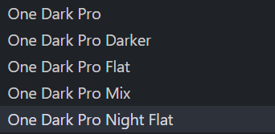
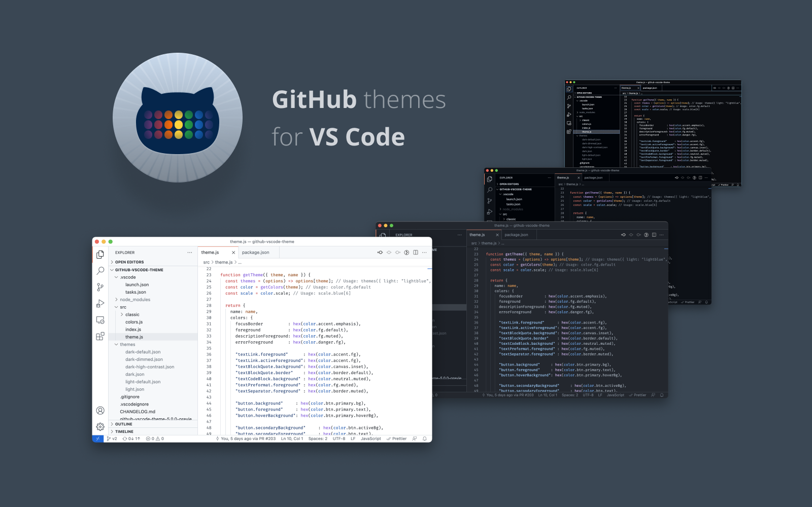
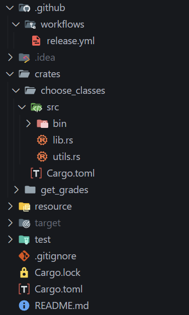
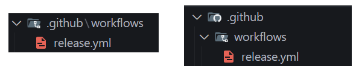
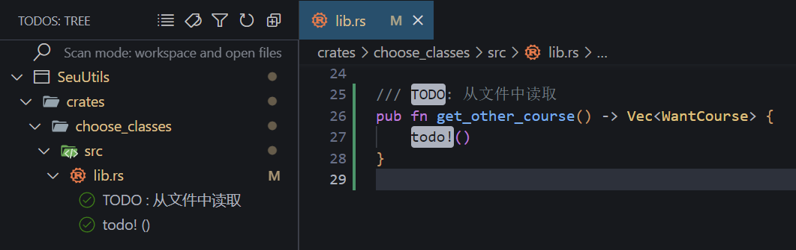
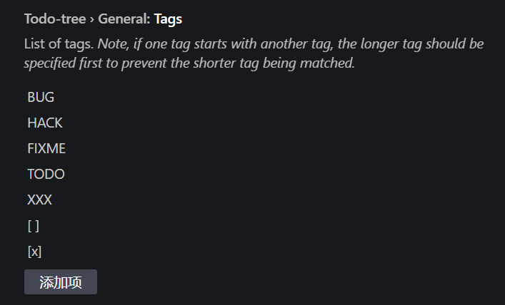
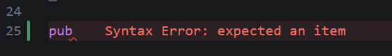
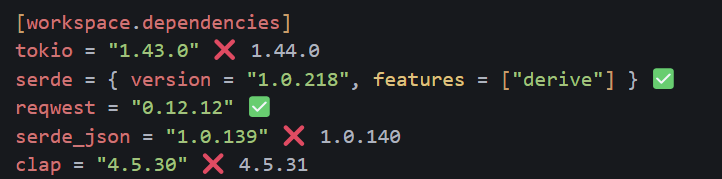

# 前言

如果你曾在 *Youtube*、*Bilibili* 等平台学习过某一编程语言，你的赛博老师或许会教你安装 [Visual Studio Code](https://code.visualstudio.com/), 然后呢？安装语言对应的插件？这样你便拥有了一个简易的可以编写代码并调试运行的环境了。

**但**，这样够吗？对于一些庞大的工程，你是否依然会放弃 *VS Code* 并投入 *JetBrains* 全家桶的怀抱？那么不妨看看本文吧，或许能为你的 *VS Code* 恢复完整之躯！

# 关于配置文件

在一切开始之前，希望你点击左下角的齿轮图标 > 配置文件 > 新建配置文件。如果你对做出的修改不满意，你随时可以退回之前的配置。

另外，我建议你将通用配置写入一个配置文件并使其默认，其余各语言的配置从其复制扩展而来。

# 外观

## 颜色主题

如何让你的 VS Code 看起来焕然一新，很简单，换个主题就完了！

[One Dark Pro](https://marketplace.visualstudio.com/items?itemName=zhuangtongfa.Material-theme) 或许是整个社区下载量最大的主题了，提供了几个不同风格的选项，或许你会喜欢



对于部分确实的代码高亮，不必担心，我们后续会补全的！

如果你不喜欢这种黑不溜秋的，试一试 [GitHub Theme](https://marketplace.visualstudio.com/items?itemName=GitHub.github-vscode-theme)，白色主题与GitHub中的效果几乎一致。



又或者你想要一些有*韵味*的主题，[Noctis](https://marketplace.visualstudio.com/items?itemName=liviuschera.noctis) 提供了一系列颜色的主题，具体就由你自己探索咯。

## 图标主题

[Material Icon Theme](https://marketplace.visualstudio.com/items?itemName=PKief.material-icon-theme) 非常好图标，使我结构清晰！



# 设置

按下 `ctrl shift P` ，在弹出的窗口中输入 *setting* ，点击*打开用户设置(JSON)*进入设置的JSON配置页面

此时，应该只有两条关于你的主题的配置

```json
{"workbench.colorTheme": "One Dark Pro Night Flat",
"workbench.iconTheme": "material-icon-theme"}
```

那么，下面是一些你可能用得到的配置项。

## 折叠文件夹

> 控制资源管理器是否应以紧凑形式呈现文件夹。在此形式中，单个子文件夹将被压缩在组合的树元素中。例如，对 Java 包结构非常有用。

```json
"explorer.compactFolders": false,
```



## 更平滑

```json
"editor.cursorSmoothCaretAnimation": "on",
"terminal.integrated.smoothScrolling": true,
"editor.cursorBlinking": "smooth",
"editor.smoothScrolling": true,
"editor.mouseWheelZoom": true,
```

始终启用平滑脱字号动画，终端将使用动画滚动，光标的动画样式为平滑，编辑器使用动画滚动，按住 `Ctrl` 键并滚动鼠标滚轮时对编辑器字体大小进行缩放。

## 编辑器

```json
"editor.wordWrap": "on",
"debug.showBreakpointsInOverviewRuler": true,
"workbench.colorCustomizations": {
    "tab.activeBackground": "#0b506e",
    "tab.activeBorder": "#00000000",
},
"editor.minimap.showSlider": "always",
"editor.formatOnSave": true,
"editor.formatOnPaste": true,
"editor.formatOnType": true,
```

控制折行的方式，将在视区宽度处换行；断点显示在概览标尺中；活动窗口标签高亮；略缩图滑块常显；我太喜欢保存后格式化了！

## 字体

虽然我经常诋毁 *Jetbrains*，但我依然推荐你在 *VS Code* 中使用其字体，你可以在 [Browse Fonts - Google Fonts](https://fonts.google.com/) 这里下载 *Jetbrains Mono* 字体，并配置

```json
"editor.fontFamily": "Consolas, Jetbrains Mono",
```

# 通用插件

## 更好的注释

[Better Comments - Visual Studio Marketplace](https://marketplace.visualstudio.com/items?itemName=aaron-bond.better-comments)

```json
"better-comments.multilineComments": true,
"better-comments.highlightPlainText": true,
"better-comments.tags": [
    {
        "tag": "# Params",
        "color": "#6A9955",
        "strikethrough": false,
        "underline": false,
        "backgroundColor": "transparent",
        "bold": true,
        "italic": false
    }
],
```

多行注释生效，高亮纯文本。用类似这样的配置来自定义高亮注释，像这样


## 收集并定位TODO

[Todo Tree - Visual Studio Marketplace](https://marketplace.visualstudio.com/items?itemName=Gruntfuggly.todo-tree)

如果你的编码喜欢良好，那你应该经常使用 TODO 注释，代表这是未完成或需要修复的代码。

举个例子，我在 `lib.rs` 文件中声明了一个未实现的函数，并使用的todo关键字进行标注，侧边栏的 *TODOS TREE* 便帮我收集并定位了 *TODO* 的位置。



然而，插件并不原生支持 RUST 的 `todo!()` ，所以我修改了配置，这样就可以了

```json
"todo-tree.regex.regex": "(//|#|<!--|;|/\\*|^|^[ \\t]*(-|\\d+.))\\s*($TAGS)|todo!",
```

其中提到的 *TAGS* 同样在设置中可以配置，不过一般不需要新增了



## 更好的错误提示

[Error Lens - Visual Studio Marketplace](https://marketplace.visualstudio.com/items?itemName=usernamehw.errorlens)

它会直接在编辑窗口高亮显示错误信息，例：



## Tab Tab

[GitHub Copilot - Visual Studio Marketplace](https://marketplace.visualstudio.com/items?itemName=GitHub.copilot)

致敬传奇副驾驶，伟大，无需多言！

# 语言插件

## C/C++

[C/C++ - Visual Studio Marketplace](https://marketplace.visualstudio.com/items?itemName=ms-vscode.cpptools) 最基础的语言插件，无需多言

`ctrl shift P` 找到 *C/C++配置(UI)* 并打开，选择你的编译器路径，指定你的编译器参数，这里我加入了 `-std=c++23`，*IntelliSense模式* 选择你对应的平台，更多 `launch.json` `tasks.json` 的配置，详见 [VSCode配置C/CPP - Where Is Mountain](https://www.harkerhand.online/新-VSCode配置C-CPP/)

鉴于没多少人用 *VS Code* 写 C/C++ 工程（其实是我没写过），下面的插件推荐会比较简单

[Code Runner - Visual Studio Marketplace](https://marketplace.visualstudio.com/items?itemName=formulahendry.code-runner) 支持 `ctrl alt N` 直接运行代码（它默认你已经配置好了环境变量），你也可以在 `Code-runner: Executor Map` 设置中自定义实现

[Competitive Programming Helper (cph) - Visual Studio Marketplace](https://marketplace.visualstudio.com/items?itemName=DivyanshuAgrawal.competitive-programming-helper) 支持从刷题平台自动捕获样例（需要浏览器插件配合）

## Java

[Extension Pack for Java - Visual Studio Marketplace](https://marketplace.visualstudio.com/items?itemName=vscjava.vscode-java-pack) 这都打包好了，那我还推荐什么，过）

## Python

[Python Extension Pack - Visual Studio Marketplace](https://marketplace.visualstudio.com/items?itemName=donjayamanne.python-extension-pack) 完了，这个也打包好了，这篇文章准备结束了）

## Rust 

太好了！是主场作战！

[rust-analyzer - Visual Studio Marketplace](https://marketplace.visualstudio.com/items?itemName=rust-lang.rust-analyzer) rust基础插件，无需多言

[C/C++ - Visual Studio Marketplace](https://marketplace.visualstudio.com/items?itemName=ms-vscode.cpptools) 是的你没看错，写Rust可以装一个C/C++插件来调试，什么ntr）

[Rust Syntax - Visual Studio Marketplace](https://marketplace.visualstudio.com/items?itemName=dustypomerleau.rust-syntax) Rust句法解析，让原本不支持Rust高亮的主题来支持它

```json
"editor.tokenColorCustomizations": {
    "[One Dark Pro Night Flat]": {
        "textMateRules": [
            {
                "scope": "variable.other.rust",
                "settings": {
                    "foreground": "#caed1e"
                }
            }
        ]
    }
},
```

主题名字改成你自己的，颜色自己DIT咯

[Even Better TOML - Visual Studio Marketplace](https://marketplace.visualstudio.com/items?itemName=tamasfe.even-better-toml) 离不开的toml高亮

[Dependi - Visual Studio Marketplace](https://marketplace.visualstudio.com/items?itemName=fill-labs.dependi) 非常好依赖管理，如图



另外 Rust  程序员通常使用三斜线来书写markdown的文档注释

那么还记得更好的注释插件吗？配置如下：

```json
"better-comments.tags": [
    {
        "tag": "# Params",
        "color": "#6A9955",
        "strikethrough": false,
        "underline": false,
        "backgroundColor": "transparent",
        "bold": true,
        "italic": false
    },
    {
        "tag": "# Returns",
        "color": "",
        "strikethrough": false,
        "underline": false,
        "backgroundColor": "transparent",
        "bold": false,
        "italic": false
    },
    {
        "tag": "# Errors",
        "color": "#FF8C00",
        "strikethrough": false,
        "underline": false,
        "backgroundColor": "transparent",
        "bold": false,
        "italic": false
    },
    {
        "tag": "-",
        "color": "#3498DB",
        "strikethrough": false,
        "underline": false,
        "backgroundColor": "transparent",
        "bold": false,
        "italic": false
    },
    {
        "tag": "# Note",
        "color": "#FF69B4",
        "strikethrough": false,
        "underline": false,
        "backgroundColor": "transparent",
        "bold": true,
        "italic": false
    },
    {
        "tag": "#",
        "color": "#9370DB",
        "strikethrough": false,
        "underline": false,
        "backgroundColor": "transparent",
        "bold": true,
        "italic": false
    },
```

---

# Ending
