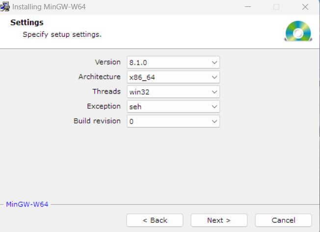

# 前言

前几日身边有人开始学习C语言, 便又重新拾起了自己的兴趣

但已经许久没有使用VS Code来调试运行C++程序, 本文记录我重新配置环境的过程


# Steps


## VS Code的下载安装

由于国内下载速度极为缓慢, 甚至网站都无法打开, 我推荐两种方法

- 使用CDN加速

  参考文章[国内下载VS Code速度慢问题解决 - 知乎](https://zhuanlan.zhihu.com/p/112215618)

  将下载地址.net及之前的部分换成`vscode.cdn.azure.cn`即可高速下载

- 使用国内下载站

  [腾讯软件中心](https://pc.qq.com/detail/16/detail_22856.html)

  缺点是版本无法自选,但起码能用

安装过程无需多言,按需勾选


## VS Code简单设置

- 汉化

  安装插件[Chinese Language Pack](https://marketplace.visualstudio.com/items?itemName=MS-CEINTL.vscode-language-pack-zh-hans)

  重启即可得到中文页面

- 安装必要插件

  [C/C++](https://marketplace.visualstudio.com/items?itemName=ms-vscode.cpptools)

- 个人推荐插件

  如果你要用VS Code来编辑Markdown文档, 需要安装插件[Markdown All in One](https://marketplace.visualstudio.com/items?itemName=yzhang.markdown-all-in-one)和[Markdown Preview Enhanced](https://marketplace.visualstudio.com/items?itemName=shd101wyy.markdown-preview-enhanced)

  另外,我个人推荐一款主题[One Dark Pro](https://marketplace.visualstudio.com/items?itemName=zhuangtongfa.Material-theme), 安装完成后使用Ctrl+K/Ctrl+T使用


## Mingw的安装

- 安装包获取

  [Download mingw-w64-install.exe](https://sourceforge.net/projects/mingw-w64/files/Toolchains%20targetting%20Win32/Personal%20Builds/mingw-builds/installer/mingw-w64-install.exe/download)

- 安装选项如图

  

- 离线安装方法

  [Download x86_64-8.1.0-release-win32-seh](https://sourceforge.net/projects/mingw-w64/files/Toolchains%20targetting%20Win64/Personal%20Builds/mingw-builds/8.1.0/threads-win32/seh/x86_64-8.1.0-release-win32-seh-rt_v6-rev0.7z/download)

  解压到任意目录即可

- 配置环境变量

  将安装目录下的bin文件夹加入系统Path


## 调试配置

### c_cpp_properties.json配置

- Ctrl+Shift+P打开命令 选择C/C++编辑配置
- 选择cpp文件所在文件夹
- 指定编译器路径
- 选择windows-gcc-x64
- 标准选择C11/C++17

### tasks.json配置

- 在.vscode文件夹内新建tasks.json文件

- 将下列代码复制进入

```json
  {
      "version": "2.0.0",
      "tasks": [
          {
              "type": "shell",
              "label": "g++.exe 生成活动文件",
              "command": "E:\\mingw64\\bin\\g++.exe",//路径
              "args": [
                  "-g",
                  "${file}",
                  "-o",
                  "${fileDirname}\\bin\\${fileBasenameNoExtension}.exe"//把exe放入bin/
              ],
              "options": {
                  "cwd": "E:\\mingw64\\bin\\"//路径
              },
              "problemMatcher": [
                  "$gcc"
              ],
              "group": "build"
          },
          {
              "type": "cppbuild",
              "label": "C/C++: g++.exe 生成活动文件",
              "command": "E:\\mingw64\\bin\\g++.exe",//路径
              "args": [
                  "-fdiagnostics-color=always",
                  "-g",
                  "${file}",
                  "-o",
                  "${fileDirname}\\bin\\${fileBasenameNoExtension}.exe"//运行exe
              ],
              "options": {
                  "cwd": "${fileDirname}"
              },
              "problemMatcher": [
                  "$gcc"
              ],
              "group": {
                  "kind": "build",
                  "isDefault": true
              },
              "detail": "调试器生成的任务。"
          }
      ]
  }
```

### launch.json配置

- 在.vscode文件夹内新建launch.json文件

- 将下列代码复制进入

```json
{
    "version": "0.2.0",
    "configurations": [

        {
            "name": "(gdb) 启动",
            "preLaunchTask": "g++.exe 生成活动文件",//调试前执行的任务
            "type": "cppdbg",//配置类型，只能为cppdbg
            "request": "launch",//请求配置类型，可以为launch（启动）或attach（附加）
            "program": "${fileDirname}\\bin\\${fileBasenameNoExtension}.exe",//exe路径
            "args": [],//调试传递参数
            "stopAtEntry": false,
            "cwd": "${fileDirname}",
            "environment": [],
            "externalConsole": false,//true显示外置的控制台窗口，false显示内置终端
            "MIMode": "gdb",
            "miDebuggerPath": "E:\\mingw64\\bin\\gdb.exe",//路径
            "setupCommands": [
                {
                    "description": "为 gdb 启用整齐打印",
                    "text": "-enable-pretty-printing",
                    "ignoreFailures": true
                }
            ]
        }
    ]
}
```

## 调试运行

- 新建一个cpp文件

  ```cpp
  #include<iostream>
  using namespace std;
  int main()
  {
      cout << "Hello World!";
      return 0;
  }
  ```

- F5运行

  gdb输出到调试控制台

  程序输出到集成终端

  

*注: 喜欢小黑框可以自行更改, 前文有注释*


# 结语

vscode是功能强大的工具, 善于利用上限极高

不过如果小白入门, 还是推荐使用集成式IDE
