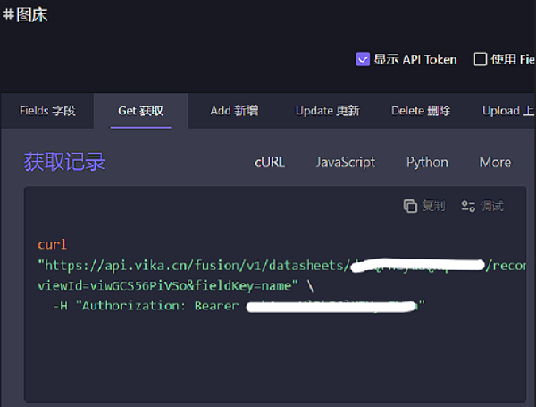

# Vika简介

> vika 维格表
>
> 是一种支持 API 的连接型智能多维表格
>
> 是新一代团队数据协作和项目管理工具
>
> 通过 vika 维格表, 你可以：
>
> - 轻松实现项目管理与团队协作
> - 不用写 1 行代码, 就可以做出适配业务发展需要的 IT 系统
> - 不懂编程也能搭建自己的数据库
> - 支持图片 视频 文档等数据存储, 将个人工作碎片化的信息结构化地整理起来
> - 开放 API, 连通一切

# Picgo简介

> **一个用于快速上传图片并获取图片 URL 链接的工具**
>
> - 灵活上传主窗口支持拖拽 选择图片上传; 支持读取剪贴板的第一张图片快捷上传
>
> - 上传成功后自动复制链接地址到剪贴板, 支持5种复制粘贴格式, 让你的文本编辑极致高效
>
> - 支持JavaScript开发的插件, 给予插件极大自由度，让PicGo更加强大, 成为你得手的效率工具

# 配置Picgo

## 下载与安装

官方有翔实的用户文档, 点击[PicGo](https://picgo.github.io/PicGo-Doc/zh/)来阅读

## 插件安装

如图

## 插件配置

进入 **图床设置** **vika维格表**

需要配置的有 **API Token** 和 **维格表ID**

进入[Vika维格表](https://vika.cn), 注册账号并登录

新建一个空白维格表, 如图

完成后点击右上角 **高级功能** **API** **Get获取** **显示API Token** 如图

上面的是 **维格表ID**

下面的是 **API Token**

其他配置项不需要更改

# 额外说明

Vika维格表每张提供1G空间

总共可以建十张表

推荐配合[TinyPNG](https://tinypng.com/)压缩图片后上传

另外 你可以通过点击我的[Vika邀请](https://vika.cn/?inviteCode=91063604)链接

或 输入我的邀请码`91063604`来获取1000V币

3000V币即可扩充空间
