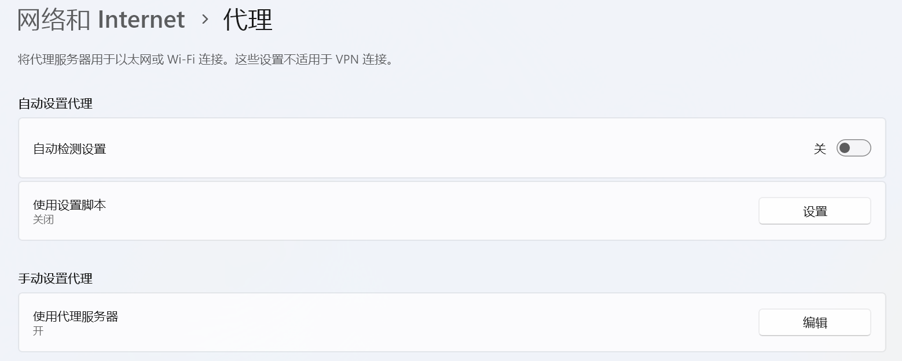
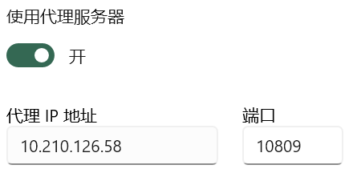
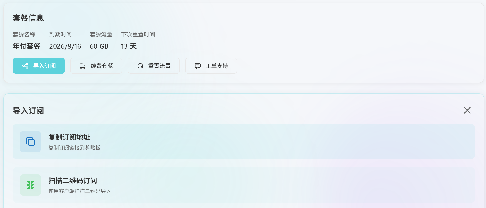
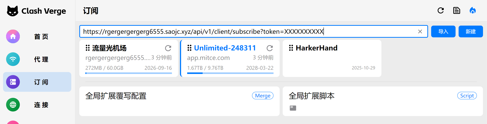
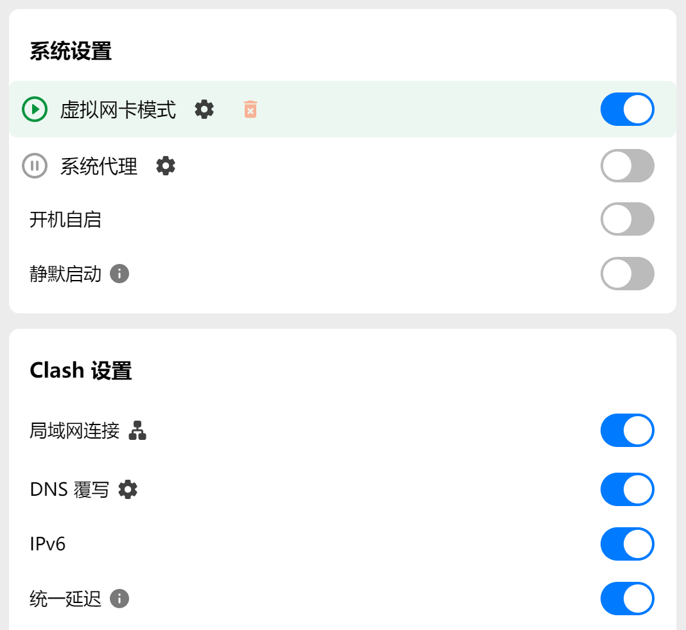
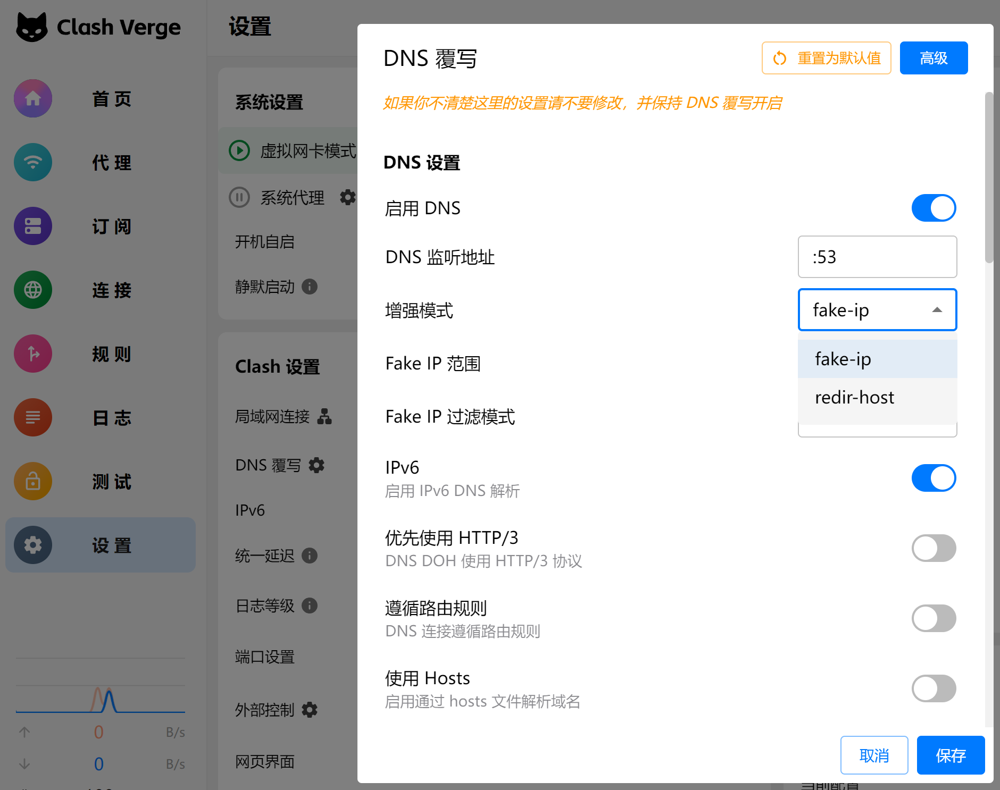
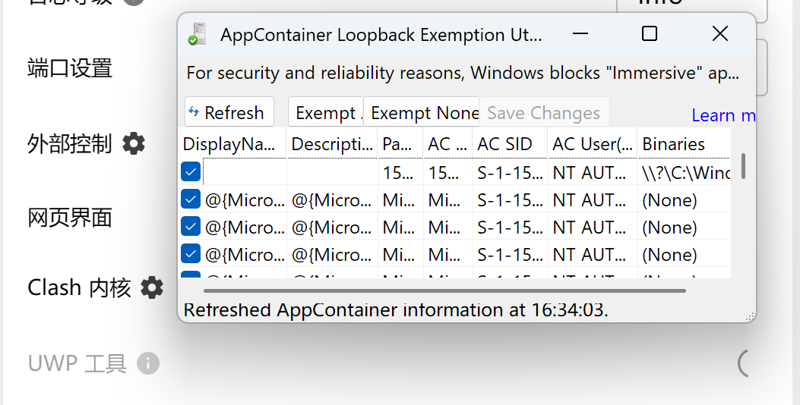
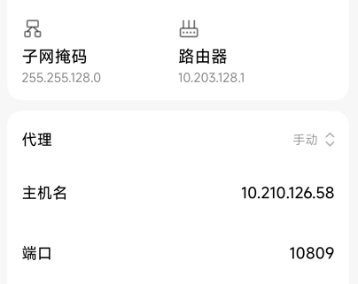
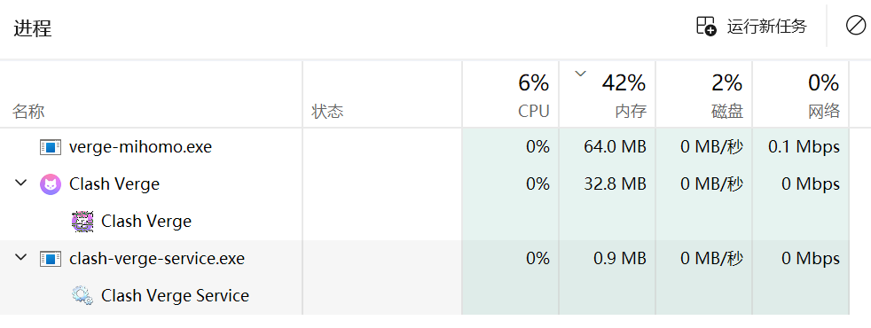
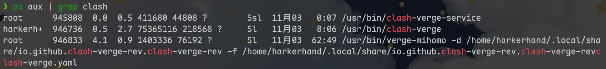

# 写在前面

前序文章是：[爱与魔法 - I++ Club](https://ippclub.org/爱与魔法/)，当时是以俱乐部的名义发的，所以在内容上更偏向了技术科普，而不是实践操作。并且有相当一部分同学看完之后其实并没有懂，就算正确操作后，在出现偶发的网络问题时也不清楚如何解决。本文的目的就是尽可能去解决这些问题。

# 小试牛刀

首先，请你先处于SEU的校园网环境下（即就是你连接了`SEU-ISP`或者`SEU-WLAN`），并且你可以ping通 `10.210.126.58`（如果你不知道什么是ping的话，点击这个链接 [怎么ping一个地址 - 搜索](https://cn.bing.com/search?q=怎么ping一个地址) ），并且你正在使用Windows 系统。

如果不满足上述条件的话，下面的小实验就不需要上手操作了，正常阅读文章即可。

 [Windows点击以打开代理设置](ms-settings:network-proxy)，点击左边这个链接，应该会进入这个页面



点击下面的 **手动设置代理** 的 **编辑** 按钮，前面三个选项按图片改，然后点击保存。



现在访问 [Google](https://www.google.com/) 应该就成功了。

**请注意：现在不要直接退出本文！！！** 

**请注意：现在不要直接退出本文！！！** 

**请注意：现在不要直接退出本文！！！**

虽然你现在已经能翻了，但并不安全，因为上面的设置会将你几乎所有的请求转发到我的电脑上，你的隐私一览无余（你也不想你访问某XX网站的事情被大家知道吧）。

所以现在你要做的是，先清除上面的**代理IP地址**和**端口**设置，然后关闭**使用代理服务器**开关，并继续阅读本文。

# 原理简介

为什么你按照上面的设置就能访问谷歌？

首先举个例子，**学生家长来食堂吃饭，但是TA没有校园卡，不能付钱。所以TA求助某位学生，给学生微信转账，让学生帮TA带饭，TA就吃上饭了**。

如果这个例子不是很形象的话，那么跟刚刚的场景对应一下。

**你想访问谷歌，但是被墙了，访问不了。所以你找到了我，把你的请求告诉我，让我帮你访问谷歌，然后我把谷歌的回复告诉你，你就访问成功了**。

在这两个例子中，学生对应我，家长对应你，饭对应网络资源。解决问题的关键是，有一个角色可以同时联系被某种因素阻隔的双方。学生可以同时使用微信和校园卡交易，我的电脑也可以同时访问校园网和谷歌。

无需深究这个中间人为什么能同时联系双方，这不是我们在意的东西，我们只需要建立这个抽象的概念就行。

# 使用代理软件

为什么不能就用上面的代理呢？原因包括但不限于：

- 你不能白嫖我的服务
- 我跟你可能在现实中相识，你敢把你的隐私交给我吗
- 我会毕业，没法让你一直用
- 代理可能会出现偶发的异常
- 。。。。。。

解决问题的方法也很简单：**找一个长期稳定提供转发服务的中间人并使用专门的代理软件**。

中间人要你的隐私大概率没什么用，他们靠卖你服务挣钱，只要不被约喝茶，几年内大概率是不会跑路。

代理软件直接在这里下载 [Clash.Verge_2.4.1_x64-setup.exe | MacPan](https://pan.harkerhand.cn/apps/Clash.Verge_2.4.1_x64-setup.exe)，中间人（下文称机场）有几个推荐：

- [狗狗加速](https://dg6.me/)
- [比好更好，比快更快 - 流量光机场](https://llgjc1.com/#/landing)
- [Mitce - 提供線上安全](https://mitce.net/?language=chinese)

不翻可能进不去，你可以暂时用一下前文提到的代理。

## 获取配置

这些中间人有很多能同时访问国内国外的服务器，而代理软件的作用是帮你自动挑选合适的服务器（下文称节点）并进行转发。

所以你需要告诉代理软件，哪些节点是你能用的，应该用什么逻辑去挑选节点，应该用什么方式进行转发，甚至高阶一点的操作是，可以选择某个特定软件的数据走特定节点，不过这些你不用太关心，机场会帮你做好。

注册账号，买服务，相信这两步应该不会有困难。在机场的首页或者个人页面，应该会找到类似**导入订阅**，**复制订阅地址**等字样，总之，摸索一下（如果要选择订阅类型，选择Clash），**最后要拿到一个网址，这个就是下载配置信息用的**。



## 导入配置

打开你刚刚装好的代理软件，点击左侧边栏的订阅，然后把刚刚获取的链接粘贴到右侧顶部的文本输入框，再点击导入，应该就大功告成了。如果导入失败的话，你可能需要分别尝试在关闭和开启代理（小试牛刀部分）的情况下导入。



## 代理软件的设置

点击左侧边栏的设置，然后看右边的设置项。设置原则是：**不懂的不要随便动**。

**系统设置**部分，建议开虚拟网卡模式，如上文所说，系统代理可能有一些问题，建议关掉。

**Clash设置**部分，建议打开DNS覆写。请忽略图示中的**局域网连接**、**IPv6**、**统一延迟**设置项，保持你的默认即可。



其他部分保持默认。

**至此，基础部分的设置就结束了，你应该可以正常的访问谷歌、Youtube等网站了**

# 常见问题

一般只有问题发生的时候才能想起来有这个问题，所以这部分可能说的不是很全，如有投稿可以联系我补充。

## 为什么关机重启之后突然就没网了

你的Clash设置了系统代理模式，重启之后系统代理设置还在，但Clash没开。把系统代理关了或者打开Clash即可。

## 为什么 Git npm 等命令行工具网络很烂

首先看你是不是用了代理模式，如果是的话，使用虚拟网卡模式重试。

其次看你的报错信息是不是有类似 `198.18`的字样，如果是的话，在Clash设置——DNS覆写——增强模式中，将fake-ip改为redir-host并重试（设置如图）。



如果还是有问题的话，尝试使用系统代理模式并在命令行设置代理环境变量（用下面贴的代码，把10809改为你的Clash设置中的端口），

```powershell
$env:HTTP_PROXY="http://127.0.0.1:10809"; $env:HTTPS_PROXY="http://127.0.0.1:10809"
```

还是有问题的话，尝试设置Git npm的代理，具体步骤使用搜索引擎，链接同上。以Git举例

```bash
git config --global http.proxy http://127.0.0.1:10809
git config --global https.proxy http://127.0.0.1:10809
```

还是有问题的话，那我不懂了。。。

# 黑魔法

## 加速Microsoft Store

在设置——UMP工具中，使用Exempt All全选，然后Save Changes退出。



## 其他设备借助本机魔法

打开设置中的局域网访问，将其他设备连接到校园网，确保其他设备能正常访问你的安装了Clash的设备。

将其他设备的代理设置为魔法设备的IP和端口，IP可以在命令行执行 `ipconfig` 来查看，端口在Clash的设置中查看。

图中举例为小米澎湃系统的设置位置



## 借助代理实现校园网免流量

原理是使用一台设备链接SEU-ISP（运营商提供的不限量网络），其他设备配置这台设备的代理。大致步骤与上一小节相同。

## 裸核运行



Clash只是一个UI，作用是帮你改配置文件，并交给核心（mihomo）来运行，图中那个服务是用于虚拟网卡模式的，可以忽略

如果使用linux会更显然一点：一个服务，一个UI，一个核心



如果想轻量级一点，就直接跑内核就行了，对于Windows，内核一般就在Clash目录下，配置一般位于`C:\Users\<username>\AppData\Roaming\io.github.clash-verge-rev.clash-verge-rev\clash-verge.yaml`。

## 自定义分流规则

前文说到，机场会给一堆节点，这些节点一般会分组，内核支持在组中以手动指定、自动选择、负载均衡等方式来选择节点。大部分机场的不同节点也会对应不同的速率、倍率、解锁规则等。

那么一个比较理想的方案是，下载大文件应该使用便宜的节点，要用AI应该切换解锁GPT的节点，看流媒体要用解锁奈飞的节点。这些都可以通过自定义配置文件来实现（如果你的机场很人性化，会帮你写好配置文件）

具体如何配置可以看这个视频 [【全网最细】一次彻底搞懂YAML分流规则：参数讲解+添加规则+故障排查](https://www.youtube.com/watch?v=_iG8vl3pzaM)

## 欢迎投稿

