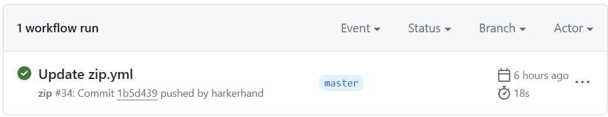

# 前情提要

本人正在进行C++课程的学习，每次作业组成为若干编程题目，每个题目需要包括测试文件.cpp，类的声明头文件.h，类的实现文件.cpp

大致的文件树在此列出

- 001
  - exp01
    - ex1.cpp
    - Complex.h
    - Complex.cpp
  - exp02
  - ...
- 002
  - exp01
  - ...
- ...

__作业提交格式 :__ 将上述文件全部打包为.zip文件发送至指定邮箱

__需求 :__ 排除本地调试生成的.exe文件，自动打包

_注 : 作者使用git来进行本地与[云端仓库](https://gitee.com/harkerhand/homework2)的链接，.gitignore文件包含了*.exe_


# Github Actions 简介

GitHub Actions 是一种持续集成和持续交付 (CI/CD) 平台，可用于自动执行生成、测试和部署管道。 您可以创建工作流程来构建和测试存储库的每个拉取请求，或将合并的拉取请求部署到生产环境。

GitHub Actions 不仅仅是 DevOps，还允许您在存储库中发生其他事件时运行工作流程。 例如，您可以运行工作流程，以便在有人在您的存储库中创建新问题时自动添加相应的标签。

GitHub 提供 Linux、Windows 和 macOS 虚拟机来运行工作流程，或者您可以在自己的数据中心或云基础架构中托管自己的自托管运行器。


# 环境准备

- 创建GitHub仓库
- 在 **Settings--Actions--General** 中更改 **Actions permissions** 为 **Allow all actions and reusable workflows**，点击 **Save** 保存
- 更改相同路径下的 **Workflow permissions** 为 **Read and write permissions**，并勾选 **Allow GitHub Actions to create and approve pull requests**，点击 **Save** 保存


# 编写Actions文件

在Actions选项卡中，选择 **set up a workflow yourself**

进入编辑界面，文件路径为 /.github/workflows/main.yml，文件名可自定义

## 语法

```yaml
name: zip
on: [push]
jobs:
  build:
    runs-on: ubuntu-latest
    steps:
    - uses: actions/checkout@v1
    - name: zip
      run: |
        for file in ./*
        do
          zip -r ./${file}/${file}.zip ${file}
        done
    - name: list files
      run:
        ls -R
    - name: commit
      run: |
        git config --global user.name "harkerhand"
        git config --global user.email "harkerhand@outlook.com"
        git add .
        git commit -m "zip" -a
    - name: push
      uses: ad-m/github-push-action@master
      with:
        github_token: ${{ secrets.GITHUB_TOKEN }}
```

- name 为流程名
- on 代表触发条件
- jobs 为流程动作
- build 为子流程名，可以有多个
- runs-on 指定了脚本运行的环境，这是一个枚举类型
- steps 为具体流程，数组类型
- uses 使用打包好的流程，这里是从远程仓库拉取至虚拟机
- name 为步骤名，可省略
- run 内为执行命令，多行脚本需要添加 |
- 使用shell命令打包并列出文件（便于后期维护）
- 在push之前设置虚拟机的git用户名和邮箱
- uses 使用打包好的push流程

*Tips : 需要在个人设置中生成名为 GITHUB_TOKEN 的 token*

# 测试

直接在GitHub更改.yml文件即被视为push，触发Actions

转到Actions选项卡，出现类似

即为成功，库文件夹中出现对应.zip文件

# 文档

[GitHub Actions 文档 - GitHub 文档](https://docs.github.com/zh/actions)
